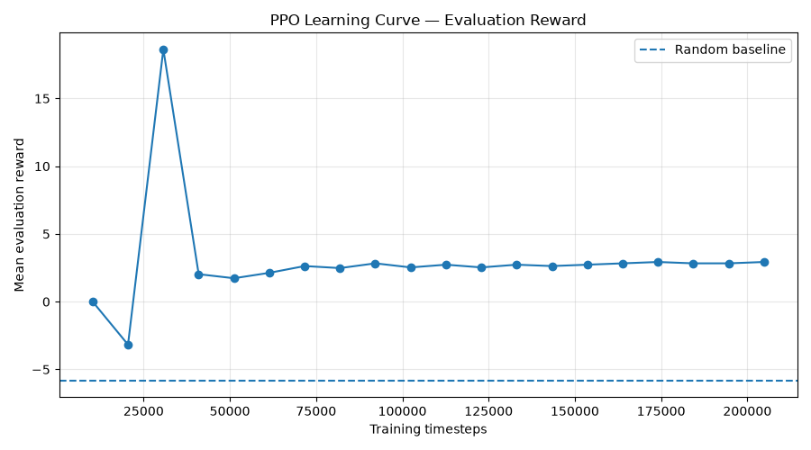
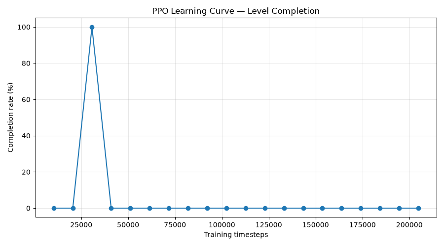
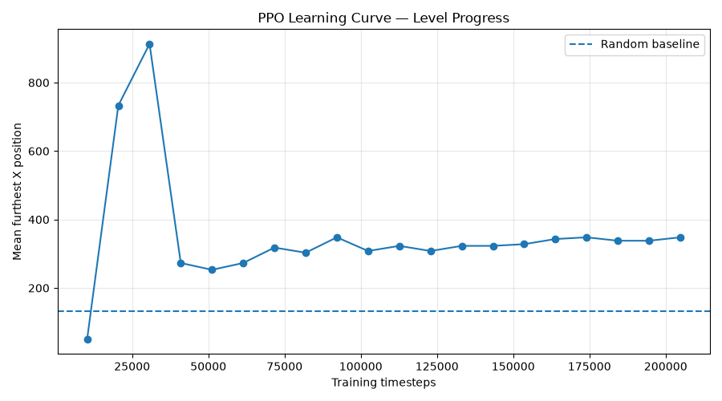

**Bamgbose Akinlade Hussein**

# PPO Platformer — Graduate Research Assistant Code Challenge

A small deterministic platformer written from scratch in Python/Pygame, together with a Gymnasium-compatible reinforcement learning environment and a PPO agent trained using Stable-Baselines3.

The project was built for the CPOLI Graduate Research Assistant Code Challenge. The goal was to implement a simple Mario-style platformer, formulate it as a reinforcement learning problem, train a PPO agent to complete the level, and provide a reproducible training and evaluation workflow.

## Submission Artifacts

- [Research Write-up (PDF)](Research_Writeup.pdf)
- [Trained Agent Gameplay (MP4)](demo/trained_model.mp4)
- [Best PPO Model](models/ppo_platformer_best.zip)

## Headline Result

The PPO agent successfully completes the level and substantially outperforms a random-action baseline.

| Metric              | Random Policy |    PPO |
| ------------------- | ------------: | -----: |
| Mean reward         |         -5.84 |  18.63 |
| Success rate        |          0.0% | 100.0% |
| Mean furthest X     |         131.8 |  913.0 |
| Mean episode length |         697.1 |  187.0 |

The selected PPO checkpoint was obtained at **30,720 training timesteps**.

Training was allowed to continue to a total budget of **204,800 timesteps**. Performance later degraded, so periodic evaluation and best-checkpoint selection were used rather than assuming the final training checkpoint would be the strongest policy.

The environment is deterministic, and evaluation uses a deterministic PPO policy. Therefore, the reported 100% completion rate represents reliable completion of this fixed deterministic level; it should not be interpreted as evidence of generalization to unseen levels.

---

## Project Structure

```text
mario_rl/
├── game.py
├── sprites.py
├── environment.py
├── main.py
├── test_environment.py
│
├── train.py
├── evaluate.py
├── config.json
├── requirements.txt
├── README.md
│
├── notebooks/
│   └── ppo_experiments.ipynb
│
├── models/
│   ├── ppo_platformer_best.zip
│   └── ppo_smoke_20k.zip
│
├── demo/
│   └── trained_agent.mp4
│
├── PPO_Platformer_Research_Writeup.pdf
│
├── results/
│   ├── random_baseline.json
│   ├── comparison.json
│   ├── headline_results.json
│   ├── learning_curve.json
│   ├── reward_curve.png
│   ├── completion_curve.png
│   └── progress_curve.png
```

### Main files

- `game.py` — core game loop, level construction, collision handling, death conditions, and goal detection.
- `sprites.py` — player, platform, enemy, hazard, and goal entities.
- `environment.py` — Gymnasium wrapper exposing the game as an RL environment.
- `main.py` — human-playable version of the platformer.
- `test_environment.py` — environment validation and determinism tests.
- `train.py` — reproducible PPO training, evaluation, checkpoint selection, result generation, and learning curves.
- `evaluate.py` — evaluates the saved PPO agent against the random baseline and optionally renders gameplay.
- `config.json` — training and evaluation configuration.
- `notebooks/ppo_experiments.ipynb` — exploratory PPO experiments and analysis.
- `demo/trained_agent.mp4` — short recording of the selected trained PPO agent completing the level.
- `PPO_Platformer_Research_Writeup.pdf` — four-page research write-up covering the MDP, method, results, limitations, reproducibility, and disclosure.

---

# Installation

## Requirements

The project was developed and tested with:

- Python 3.13.15
- Pygame 2.6.1
- Gymnasium 1.3.0
- Stable-Baselines3 2.9.0
- PyTorch 2.14.1
- NumPy 2.5.3
- Matplotlib 3.11.2

Exact dependency versions are pinned in `requirements.txt`.

## Create a virtual environment

From the project directory:

```bash
python3 -m venv .venv
source .venv/bin/activate
```

On Windows, activation can instead be performed with the appropriate virtual-environment activation command for the shell being used.

Install the dependencies:

```bash
python3 -m pip install --upgrade pip
python3 -m pip install -r requirements.txt
```

---

# Playing the Game Manually

Run:

```bash
python3 main.py
```

Controls:

| Key         | Action      |
| ----------- | ----------- |
| Left Arrow  | Move left   |
| Right Arrow | Move right  |
| Space       | Jump        |
| R           | Reset level |

The level contains solid ground/platforms, gaps that can cause the player to fall, an enemy, a stationary hazard, and a goal.

---

# Reinforcement Learning Environment

The game is wrapped in a Gymnasium-style environment through `PlatformerEnv`.

The main API follows:

```python
observation, info = env.reset(seed=42)

observation, reward, terminated, truncated, info = env.step(action)
```

The environment can run headlessly during training so that rendering is not required.

## Observation Space

The agent receives an **11-dimensional feature vector** rather than raw pixels.

The observation contains:

```text
[
    player_x,
    player_y,
    player_direction_x,
    player_velocity_y,
    player_on_ground,
    enemy_x,
    enemy_y,
    hazard_x,
    hazard_y,
    goal_x,
    goal_y
]
```

Positions are scaled relative to the game dimensions, and vertical velocity is scaled for the observation.

Using a compact feature representation was a deliberate choice. It makes the learning problem substantially smaller than pixel-based control and allows the experiment to focus on PPO behavior rather than visual representation learning.

Because this is a fixed level, the agent does not receive an explicit map of platform/gap geometry. Position therefore implicitly identifies where the agent is within the known level. This is a limitation for generalization to unseen level layouts.

## Action Space

The environment uses a discrete action space with six actions:

| Action | Meaning                |
| -----: | ---------------------- |
|      0 | No horizontal movement |
|      1 | Move left              |
|      2 | Move right             |
|      3 | Jump                   |
|      4 | Move left + jump       |
|      5 | Move right + jump      |

## Reward Function

The base reward is proportional to horizontal progress:

```text
reward = (current_x - previous_x) × 0.01
```

The agent additionally receives:

```text
+10  for reaching the goal
-10  for dying
```

This gives the agent dense feedback for progressing through the level while strongly distinguishing successful completion from death.

One limitation of this reward formulation is that there is no explicit per-step time penalty. Progress reward can therefore favor policies that make partial forward progress even when they do not ultimately complete the level.

## Episode Termination

An episode terminates when:

- the player reaches the goal;
- the player collides with an enemy;
- the player collides with a hazard; or
- the player falls out of the level.

An episode is truncated when the configured maximum number of steps is reached.

The default maximum episode length is:

```text
1000 steps
```

---

# PPO Training

The agent is trained using PPO from Stable-Baselines3 with an `MlpPolicy`.

The primary configuration is stored in `config.json`.

The experiment uses:

| Hyperparameter                 |             Value |
| ------------------------------ | ----------------: |
| Seed                           |                42 |
| Total training budget          | 204,800 timesteps |
| Evaluation interval            |  10,240 timesteps |
| Evaluation episodes/checkpoint |                20 |
| Learning rate                  |              3e-4 |
| PPO rollout steps (`n_steps`)  |              1024 |
| Batch size                     |                64 |
| Epochs/update                  |                10 |
| Gamma                          |              0.99 |
| GAE lambda                     |              0.95 |
| PPO clip range                 |               0.2 |
| Entropy coefficient            |              0.01 |
| Maximum episode length         |              1000 |

## Train From Scratch

From the project root:

```bash
python3 train.py
```

The script:

1. evaluates a random-action baseline;
2. creates a fresh PPO model;
3. trains to a total budget of 204,800 timesteps;
4. evaluates the policy every 10,240 timesteps;
5. records reward, completion rate, progress, and episode length;
6. selects the best checkpoint;
7. saves the best model;
8. generates learning-curve data and plots;
9. reloads the saved model from disk; and
10. performs a final evaluation against the random baseline.

The checkpoint selection rule is:

```text
1. Highest evaluation success rate
2. Mean reward as the tie-breaker
```

The resulting model is saved as:

```text
models/ppo_platformer_best.zip
```

---

# Evaluation

Evaluate the saved PPO agent without rendering:

```bash
python3 evaluate.py
```

This evaluates both the random baseline and the trained PPO policy.

A reproduced evaluation of the saved model produced:

```text
Metric                       Random            PPO
-------------------------------------------------------
Mean reward                   -5.84          18.63
Success rate                   0.0%         100.0%
Mean furthest X               131.8          913.0
Episode length               697.1          187.0
```

To evaluate and then watch the PPO agent play:

```bash
python3 evaluate.py --render
```

The rendered saved policy completed the level with:

```text
Won: True
Final X: 913
Total reward: 18.63
Steps: 187
```

## Gameplay Demo

A short recording of the selected trained PPO agent completing the level is included in the repository:

[`demo/trained_agent.mp4`](demo/trained_model.mp4)

The saved policy can also be replayed directly from the project with:

```bash
python3 evaluate.py --render
```

---

# Learning Curve and Checkpoint Selection

The strongest policy appeared relatively early in training.

Key evaluation checkpoints included:

| Training Steps | Mean Reward | Completion | Mean Furthest X |
| -------------: | ----------: | ---------: | --------------: |
|         10,240 |        0.00 |         0% |              50 |
|         20,480 |       -3.17 |         0% |             733 |
|     **30,720** |   **18.63** |   **100%** |         **913** |
|         40,960 |        2.03 |         0% |             273 |
|         92,160 |        2.83 |         0% |             348 |
|        204,800 |        2.93 |         0% |             348 |

The full learning curves are saved under `results/`.

### Reward



### Completion Rate



### Level Progress



## Training Degradation

A notable result was that additional PPO training did not monotonically improve performance.

At 30,720 timesteps, the policy completed the level. Later checkpoints lost this behavior even though some continued to achieve positive progress reward.

Rather than using the final 204,800-step policy automatically, training periodically evaluates the current policy and preserves the strongest observed checkpoint.

This result also highlights a limitation of the current reward formulation and deterministic single-level setup. Future experiments could investigate reward design, entropy settings, PPO hyperparameters, checkpoint stability, and evaluation across randomized level configurations.

---

# Random Baseline

A random-action policy was evaluated using the same environment.

Across 100 evaluation episodes:

```text
Mean reward:       -5.838
Success rate:       0.0%
Mean furthest X:   131.8
Mean episode length: 697.1
```

The PPO checkpoint substantially outperformed the random baseline in reward, level progress, episode length, and successful completion.

---

# Determinism and Reproducibility

The experiment uses seed:

```text
42
```

Python, NumPy, PyTorch, PPO, and environment reset behavior are seeded as part of the training workflow.

The game itself currently contains no stochastic mechanics. Therefore, for a fixed trained policy, evaluation is effectively deterministic.

Environment testing also verified that a fixed sequence of actions after resetting with the same seed produces identical observations, rewards, and termination behavior.

The original experiment was first developed interactively in `notebooks/ppo_experiments.ipynb`.

The same experiment was then reproduced independently using:

```bash
python3 train.py
```

The standalone run reproduced the same selected checkpoint and headline metrics:

```text
Best checkpoint: 30,720 timesteps
Mean PPO reward: 18.63
PPO success rate: 100.0%
Mean furthest X: 913.0
Mean episode length: 187.0
```

The newly generated saved model was subsequently loaded in a separate invocation of:

```bash
python3 evaluate.py
```

and reproduced the same results.

Exact Python dependencies are pinned in `requirements.txt`.

Fixed seeds improve reproducibility, but exact numerical reproducibility across different operating systems, hardware, Python versions, PyTorch versions, or dependency versions is not guaranteed.

---

# Hardware and Training Time

The reproduced standalone experiment was run on:

```text
Machine: MacBook Pro
Chip: Apple M5
CPU: 10 cores (4 Super + 6 Efficiency)
Memory: 16 GB
Python: 3.13.15
```

Training the full **204,800-timestep** experiment took approximately:

```text
52.30 seconds
```

on this machine.

This time covers the training loop measured by `train.py`; installation/setup time is not included.

The project does not require GPU/CUDA-specific setup.

---

# Results Artifacts

Machine-readable experiment results are stored under `results/`.

```text
random_baseline.json
    Random-policy evaluation.

learning_curve.json
    Evaluation metrics at each PPO checkpoint.

comparison.json
    Final random-vs-PPO comparison.

headline_results.json
    Reproducibility metadata and headline result.

reward_curve.png
    Mean evaluation reward vs. training steps.

completion_curve.png
    Level completion rate vs. training steps.

progress_curve.png
    Mean furthest horizontal position vs. training steps.
```

The trained model is stored under:

```text
models/ppo_platformer_best.zip
```

---

# Limitations

This project intentionally uses a small, controlled RL problem, and the results should be interpreted within that scope.

The main limitations are:

- The environment contains a single fixed level.
- Game dynamics currently contain no randomness.
- The observation uses engineered state features rather than pixels.
- Static platform/gap geometry is not explicitly represented in the observation.
- Evaluation episodes therefore do not measure generalization across different level layouts or dynamics.
- The 100% success rate represents deterministic completion of this level rather than performance over a distribution of unseen levels.
- PPO performance was unstable during continued training after the successful 30,720-step checkpoint.
- The reward function rewards horizontal progress but does not contain an explicit time penalty.

These limitations provide several natural directions for further experimentation.

---

# Possible Next Steps

Potential extensions include randomized starting states, multiple levels, randomized enemy behavior, local platform/gap information in the observation, reward-shaping ablations, PPO hyperparameter experiments, comparison with another RL algorithm, and evaluation across multiple environment seeds with genuine environment stochasticity.

A particularly interesting follow-up would be investigating why the successful policy at 30,720 timesteps was lost during continued PPO optimization and whether alternative reward design or training settings make successful behavior more stable.

---

# Tools, Libraries, and AI Assistance

The game environment itself was implemented specifically for this challenge rather than using an existing Mario or platformer reinforcement-learning environment.

External libraries used include:

- Pygame for game rendering, sprites, and collision primitives.
- Gymnasium for the reinforcement-learning environment interface and spaces.
- Stable-Baselines3 for the PPO implementation.
- PyTorch as the underlying neural-network framework used by Stable-Baselines3.
- NumPy for numerical operations.
- Matplotlib for experiment visualizations.
- JupyterLab for exploratory experiments.

Learning references included:

- [Clear Code — The ultimate introduction to Pygame](https://www.youtube.com/watch?v=AY9MnQ4x3zk)
- [Johnny Code — Build a Custom Gymnasium Reinforcement Learning Environment & Train w Q-Learning & Stable Baselines3](https://www.youtube.com/watch?v=AoGRjPt-vms)

These tutorials were used as learning references for Pygame structure and custom Gymnasium/RL environment concepts; no existing Mario RL environment or pretrained policy was copied into the project.

ChatGPT was used during development as an AI-assisted programming and research tool. Assistance included discussing the game/environment design, explaining implementation details, helping formulate the Gymnasium interface and PPO experiment, debugging, designing evaluation and reproducibility procedures, and assisting with documentation.

The implementation was tested locally, including manual gameplay, environment validation, deterministic trajectory testing, PPO training, saved-model loading, random-baseline comparison, standalone training reproduction, and rendered agent evaluation.

No pretrained policy or existing Mario reinforcement-learning environment was used.

---

# Summary

This project demonstrates an end-to-end reinforcement learning workflow:

```text
Custom platformer
        ↓
Gymnasium environment
        ↓
Random baseline
        ↓
PPO training
        ↓
Periodic evaluation
        ↓
Best-checkpoint selection
        ↓
Saved policy
        ↓
Independent evaluation
        ↓
100% completion of the deterministic level
```

The final selected PPO policy reaches the goal in 187 steps with a reward of 18.63, compared with a random-policy success rate of 0%.

The experiment can be reproduced from the command line using:

```bash
python3 train.py
```

and the resulting saved policy can be evaluated using:

```bash
python3 evaluate.py
```

or watched interactively using:

```bash
python3 evaluate.py --render
```
